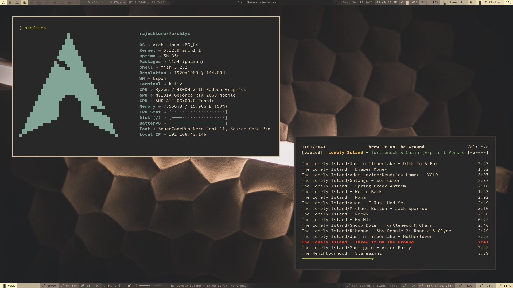
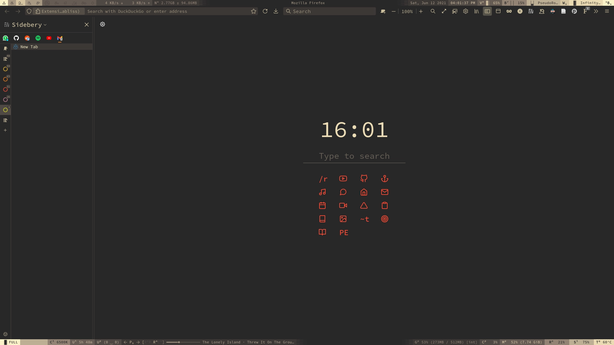
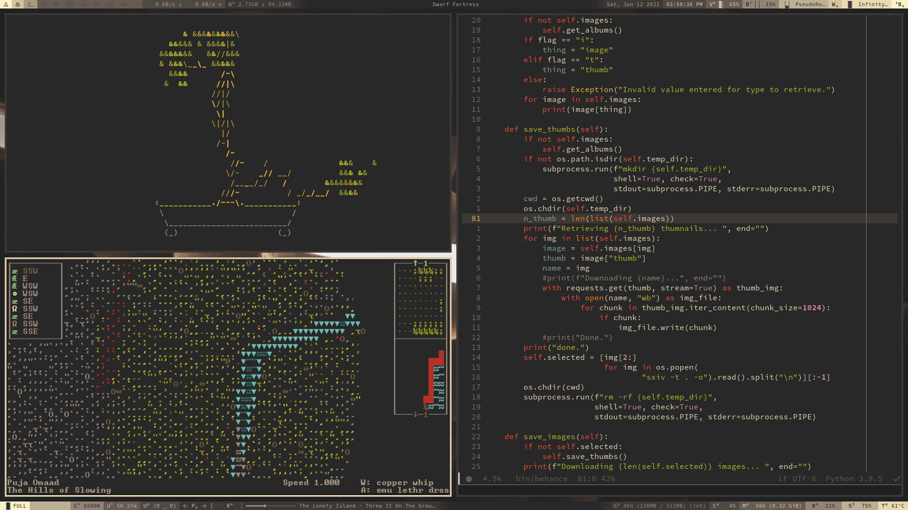
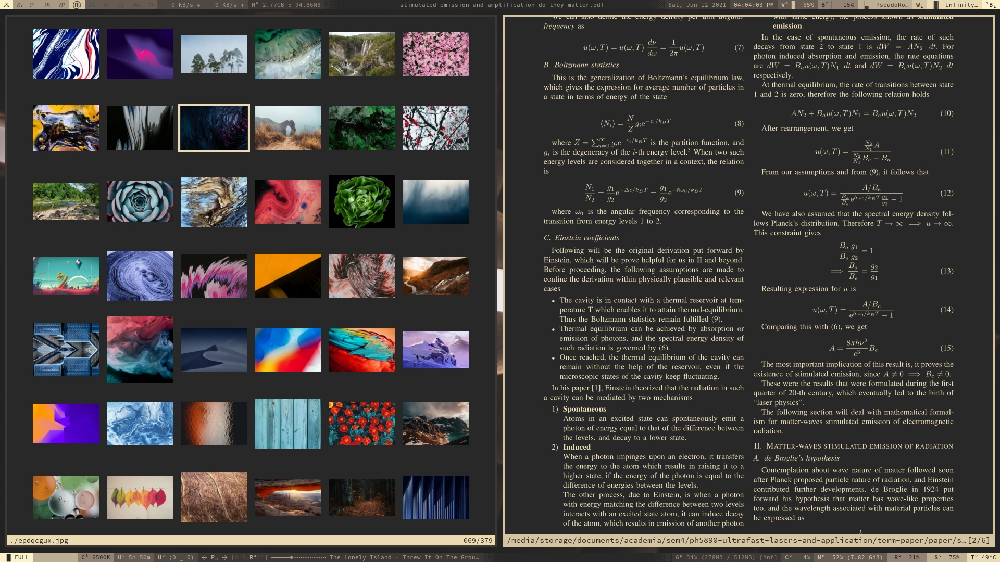
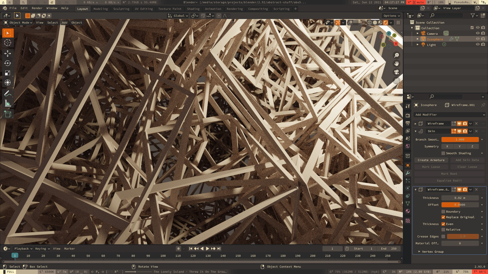

## gruvbox-themed rice with maximum usability (opinionated).

have some cherry-picked eye-candies.

### niche'd `neofetch`, and ~~ncmpp~~ ~~ncmcp~~ `ncmpcpp`

### firefox start-page using `tabliss`

### hacking, amirite? (`unimatrix` + internet stats using `vnstatrc`)

### ansi is life i have no idea what's going on (`cbonsai`,

`doom-emacs` and `dwarf-fortress`)

### my papes (`sxiv`) and paper (`zathura`)

### open source ftw (`blender`)

The config files are crude and hack-y as of now. I have plans to refactor them, organise and provide whats-what in near future.
